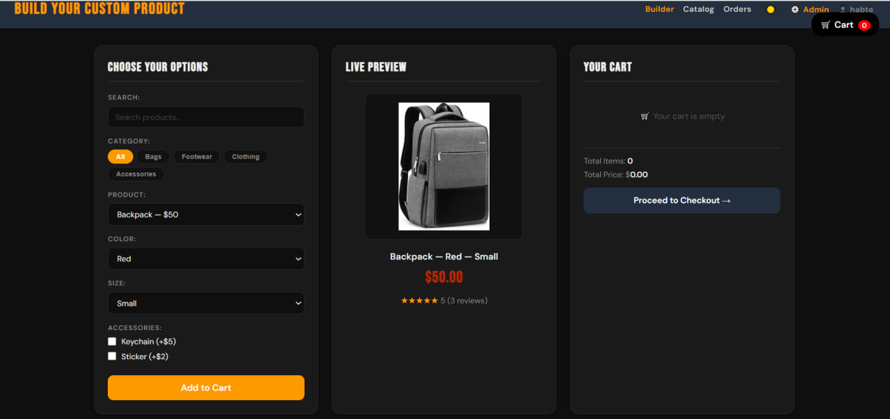
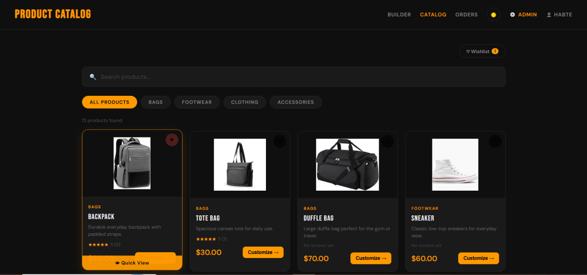
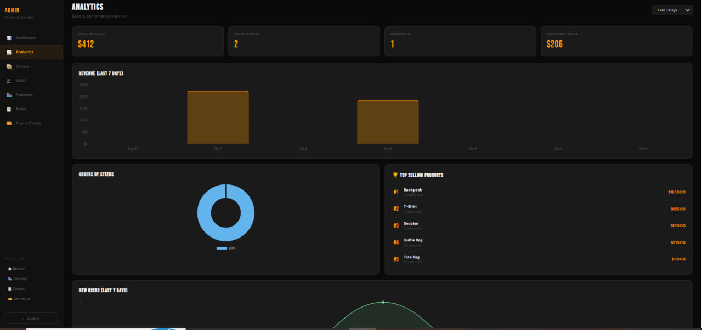
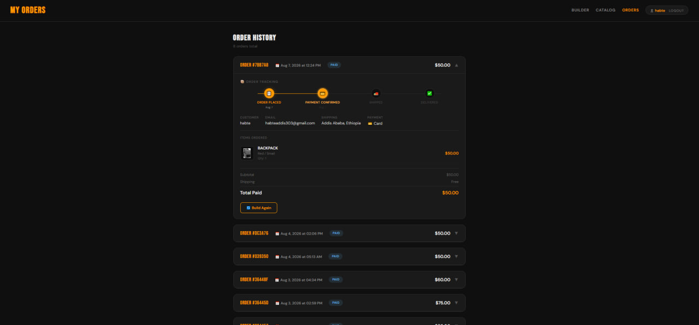

# 🛠️ Custom Product Builder

A full-stack e-commerce web application where users can customize products, manage their cart, and place real payments — built with vanilla JavaScript, Node.js, MongoDB, and Stripe.

🔗 **Live Demo:** [https://whimsical-stardust-600256.netlify.app](https://whimsical-stardust-600256.netlify.app)
⚙️ **Backend API:** [https://custom-product-backend-1x5x.onrender.com](https://custom-product-backend-1x5x.onrender.com)

> ⚠️ The backend runs on Render's free tier — it may take **20–30 seconds to wake up** on first request after a period of inactivity.

---

## ✨ Features

### 🛒 Shopping Experience
- **Product Builder** — customize color, size, and accessories with live preview
- **Product Catalog** — browse all products with search, category filters, and ratings
- **Quick View Modal** — preview any product without leaving the catalog
- **Wishlist** — save favorite products (persists across sessions via localStorage)
- **Shopping Cart** — add/remove items with quantity controls
- **Skeleton Loading** — shimmer placeholders while data loads

### 💳 Payments & Orders
- **Stripe Payments** — secure card payments (test mode)
- **Promo Codes** — apply discount codes at checkout
- **Order History** — view all past orders from MongoDB
- **Order Tracking Timeline** — visual 4-step progress tracker (Placed → Paid → Shipped → Delivered)
- **Email Notifications** — order confirmation sent via Resend API

### ⭐ Reviews & Ratings
- **Star Ratings** — 1–5 star ratings with averages shown on catalog
- **Written Reviews** — users can write and submit reviews
- **Verified Purchase Badge** — shown if user actually ordered the product
- **Helpful Votes** — mark reviews as helpful

### 👤 Authentication
- **JWT Authentication** — secure login and registration
- **Role-based Access** — admin vs regular user
- **Protected Routes** — order history and checkout require login

### 📊 Admin Dashboard
- **Sales Analytics** — revenue charts, order stats, top products (7/14/30 days)
- **Order Management** — update order status (pending → paid → shipped → delivered)
- **User Management** — view all registered users
- **Product CRUD** — add, edit, delete products
- **Stock Management** — track and update stock levels per product
- **Promo Code Manager** — create and manage discount codes (% or fixed)

### 🎨 UI/UX
- **Dark/Light Mode** — theme toggle saved to localStorage
- **Skeleton Loading** — shimmer placeholders while data loads
- **PWA** — installable on mobile like a native app
- **Offline Support** — works without internet (cached assets via Service Worker)
- **Responsive Design** — works on all screen sizes

---

## 🛠️ Tech Stack

### Frontend
| Technology | Purpose |
|---|---|
| Vanilla JavaScript (ES Modules) | Core logic — no framework |
| HTML5 + CSS3 | Structure and styling |
| Stripe.js | Payment UI |
| Chart.js | Analytics charts |
| Service Worker + Web App Manifest | PWA + offline support |

### Backend
| Technology | Purpose |
|---|---|
| Node.js + Express | REST API server |
| MongoDB + Mongoose | Database and ODM |
| JWT + bcryptjs | Authentication |
| Stripe API | Payment processing |
| Resend HTTP API | Email notifications (avoids SMTP port blocks) |

### Deployment
| Service | Purpose |
|---|---|
| Netlify | Frontend hosting (auto-deploy from GitHub) |
| Render | Backend hosting (free tier) |
| MongoDB Atlas | Cloud database |

---

## 🚀 Getting Started

### Prerequisites
- Node.js 18+
- MongoDB Atlas account (free tier)
- Stripe account (test mode)
- Resend account (free tier — [resend.com](https://resend.com))

### Backend Setup

```bash
# Clone the backend repository
git clone https://github.com/habte2112/custom-product-backend.git
cd custom-product-backend

# Install dependencies
npm install

# Create .env file and fill in your values
cp .env.example .env

# Start development server
npm run dev
```

### Environment Variables

```env
PORT=5000
MONGO_URI=mongodb+srv://<user>:<pass>@cluster.mongodb.net/product-builder
JWT_SECRET=your_jwt_secret_here
STRIPE_SECRET_KEY=sk_test_...
RESEND_API_KEY=re_...
ADMIN_EMAIL=your@email.com
CLIENT_URL=https://whimsical-stardust-600256.netlify.app
```

### Frontend Setup

```bash
# Clone the frontend repository
git clone https://github.com/habte2112/custom-product-builder.git
cd custom-product-builder

# Open with VS Code Live Server, or deploy to Netlify
```

No build step needed — it's plain HTML/CSS/JS.

---

## 🧪 Test Credentials

### Stripe Test Card
```
Card Number : 4242 4242 4242 4242
Expiry      : Any future date  (e.g. 12/26)
CVC         : Any 3 digits     (e.g. 123)
ZIP         : Any 5 digits     (e.g. 12345)
```

### Test User Account
```
Email    : testuser@example.com
Password : password123
```

### Test Admin Account
```
Email    : admin@example.com
Password : admin123
```

---

## 📁 Project Structure

```
custom-product-builder/          ← Frontend (Netlify)
├── index.html                   # Product builder page
├── catalog.html                 # Product catalog
├── checkout.html                # Stripe checkout
├── order-history.html           # Order tracking
├── login.html                   # Auth page
├── admin.html                   # Admin dashboard
├── 404.html                     # Custom 404 page
├── manifest.json                # PWA manifest
├── sw.js                        # Service worker
├── netlify.toml                 # Netlify config + cache headers
├── scripts/
│   ├── products.js              # Product data
│   ├── builder.js               # Builder UI logic
│   ├── cart.js                  # Cart state management
│   ├── catalog.js               # Catalog + wishlist + quick view
│   ├── checkout.js              # Stripe checkout flow
│   ├── reviews.js               # Reviews widget
│   ├── theme.js                 # Dark/light mode toggle
│   ├── pwa.js                   # PWA install + offline bar
│   └── utils.js                 # Shared helpers
└── styles/
    ├── main.css                 # Base styles + CSS variables
    └── theme.css                # Dark/light theme tokens
```

```
custom-product-backend/          ← Backend (Render)
├── server.js                    # Express app entry point
├── models/
│   ├── User.js
│   ├── Order.js
│   ├── Product.js
│   ├── Review.js
│   └── PromoCode.js
├── routes/
│   ├── auth.js                  # Register, login
│   ├── orders.js                # Create, fetch orders
│   ├── products.js              # Product CRUD
│   ├── payment.js               # Stripe payment intent
│   ├── reviews.js               # Reviews CRUD + helpful votes
│   └── admin.js                 # Admin dashboard + analytics
├── middleware/
│   └── auth.js                  # JWT protect + adminOnly
└── config/
    └── email.js                 # Resend HTTP API email sender
```

---

## 🔌 API Overview

| Method | Endpoint | Description |
|---|---|---|
| POST | `/api/auth/register` | Create account |
| POST | `/api/auth/login` | Login and get JWT |
| GET | `/api/products` | List all products |
| POST | `/api/orders` | Place an order |
| GET | `/api/orders/my` | Get user's orders |
| POST | `/api/payment/create-intent` | Create Stripe payment intent |
| GET | `/api/reviews/:productId` | Get reviews for a product |
| POST | `/api/reviews` | Submit a review (auth required) |
| GET | `/api/admin/stats` | Dashboard stats (admin only) |
| GET | `/api/admin/analytics` | Charts data (admin only) |

---

## 🎯 Key Learning Outcomes

- Building a complete full-stack application from scratch without any framework
- Integrating third-party APIs (Stripe, Resend, MongoDB Atlas)
- Implementing JWT authentication with role-based access control
- Switching from SMTP to HTTP API for email delivery (Render blocks ports 587/465)
- Creating a Progressive Web App with Service Worker caching and offline support
- Designing and building a RESTful API with Express and MongoDB aggregation pipelines
- Managing state with localStorage and MongoDB
- Deploying a frontend + backend to separate free hosting services (Netlify + Render)
- Building responsive, accessible UI without any CSS framework

---

## 📸 Screenshots


| Builder | Catalog | Admin Dashboard | Orders |

### Builder Page


### Product Catalog


### Admin Dashboard


### Order Tracking


---

## 📄 License

MIT License — free to use for learning and portfolio purposes.

---

## 👨‍💻 Author

**Habte Addis** — Addis Ababa University Student @ CTBE  
Building full-stack web applications as a passion project.
📧 habteaddis303@gmail.com
🔗 LinkedIn
🐙 GitHub

⭐ If you found this useful, please give it a star!